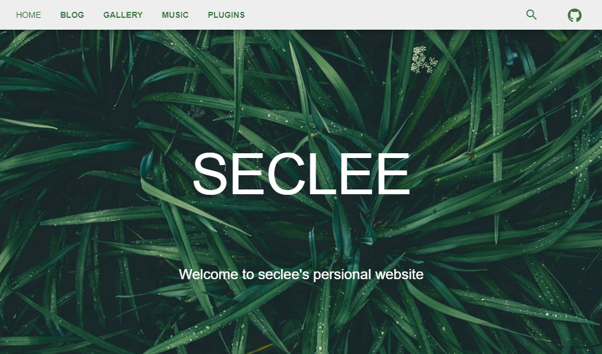

<div align="center">
  <h1 align="center">
    Artist
  </h1>
  <h3 align="center">
     An open source adaptive blog based on vue, quasar and django
  </h3>

  [Download(closed recently)](https://https://github.com/derekwin/Artist_blog) | [Homepage](http://www.seclee.com/) | [Blog](https://derekwin.github.io)

</div>

<div align="center">
  

</div>

## 介绍
演示站点: [seclee.com](http://www.seclee.com/)

Artist采用前后端分离构建，前端由vue搭配quasar实现,后端由~flask~->`django`实现api，数据库目前采用~mysql~->`sqlite`。多端自适应。

本项目目前存放的是前端部分，~包括博客后台~->`后台使用django重写中`。

本项目先构建了vue项目，通过引入插件的形式引入quasar。该方式和直接利用quasar-cli构建项目有所不同。
quasar中文网的翻译版本较老，加上quasar英文官网并没有就两种方式的差别做说明（其实也是我菜。）
```
for Quasar CLI:
 

for Vue CLI:

<q-img :src="require('@/assets/logo.png')" />
Webpack catches "src" attribute on native "" tags only, so you need to force this on a component.
```

~后台的markdown编辑器基于[mavonEditor](https://github.com/hinesboy/mavonEditor)~->`新后台的方案后续再定`。


## 在本地运行(2020.4.2->目前不可运行，升级维护中)
### 克隆项目
```
git clone https://github.com/derekwin/Artist_blog
```

### 安装npm依赖
```
npm install
```

### 运行
```
npm run serve
```

### 打包
```
npm run build
```

## 性能方面需要进一步完善
- 图片进行进一步压缩 ->2020.4.2->`django重写后台后，预计将这个功能直接集成到后端`。
- gallery页面的图片资源按需加载 
- 屏蔽sourceMap 
- CND加速，引入外部资源CDN

## github项目完整性进度
- 2019.9.8 上传了前端部分，包括后台的前端。~由于时间安排问题，后端的更新预计2020.1.1之后才能正常进行。~
- `2020.4.2 quasar最近半年来的更新迭代有点不小，现在的blog版本已经没法正常编译，运行。之前一直在试的flask方案最终放弃，近期打算用最新的quasar-vue-cli版本来重写这个博客应用，吸取前面的教训，把各个模块做的更整洁可复用点。后端抛弃flask，转向django，没办法，用django真的省太多事儿了，同时用django的话，我打算把原来vue实现的后端改用django的模块重写，这样能更统一一点。`


## 环境配置避坑指南
- sudo apt-get install nodejs
- npm install n -g
- n stable
- npm install npm -g
- npm install -g cnpm --registry=https://registry.npm.taobao.org
- cnpm install -g @vue/cli
- sudo mkdir app
- vue create app
- cd app/
- vue add quasar
- npm install vue-router
